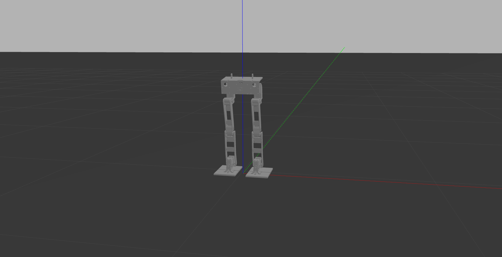

# Simulation-of-Walking-Biped

Simulation of a walking biped in ROS-Gazebo.

<figure class="image">
  
  <figcaption></figcaption>
</figure>

<h3>Launch the simulation</h3>
To start the simulation you have to launch the following commands:

```
>> catkin_make
>> roslaunch biped_sensor gazebo.launch
```

To move the biped you have to move in the directory /biped_control/src and launch the command (for C++ node):

```
>> rosrun biped_sensor walk <initial_foot> <#_steps> <directory_CSV>
```

where you have to replace <initial_foot> with the letter of the foot with which you want to start the walk (R / L), <#_steps> with the number of steps and <directory_CSV> with the name of one of the directories contained in /src, they respresent the different shapes of walk studied.
An example of a possible command is:

```
>> rosrun biped_sensor walk R 3 SLWAVR_SINw50h45dCM11i20
```


<figure class="image">
  
  <figcaption></figcaption>
</figure>
